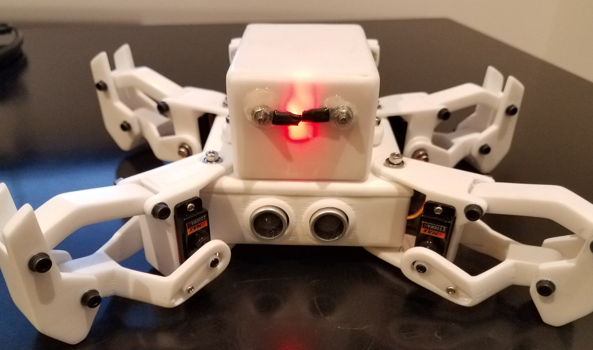
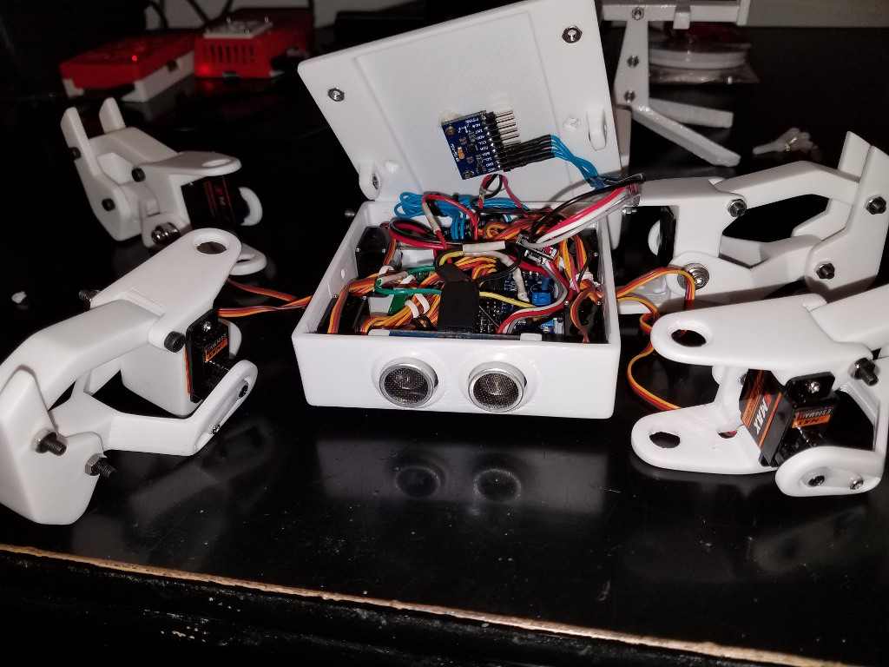

# Peabot

## Overview

This software controls a custom-built quadruped robot. Namely, this guy:

## Mechanical Features

Each of the robot's four legs is moved by two separate micro 9G servos. The 
servos are able to rotate about 165 degrees, although physical joints of 
the robot are able to rotate somewhat less so. 

## Components

### Raspberry Pi Zero
The central component of the robot is the ever popular Raspberry Pi, which is a 
fully functioning computer, configured to run the Raspbian operating system.

### Adafruit PCA9685 servo controller breakout
This controller is able to take I2C input from the Raspberry Pi's applicable 
pins, and multiplex that signal through 16 channels. In this case, the robot 
uses 8 of the controller's pins, 0-7, to control its 8 servos. 

*Note* A 1000mf capacitor is attached to the servo controller as indicated by 
the manufacturer in order to provide better power to the servos.

### RioRand ESO8MA 9G micro servos
These are the robots source of mechanical movement, allowing for precise 
rotation of the robot's joints.

### HC-SR04 ultrasonic distance sensor
In addition to serving as a neato robot face, this sensor detects the distance 
between itself and any obstructions directly in front of it using ultrasonic 
echos (like a bat).

### MPU-9250 9DOF sensor breakout
This sensor is able to capture gyroscopic rotation, magnetic bearing and 
acceleration of the robot. In future versions of the robot's software, the 
robot will be able to use this information to navigate on its own.

## Wiring and Pins

The electronic components of the robot are wired in the following way:

### Raspberry Pi GPIO Pins:

**GPIO 1** -> PCA9685 INPUT VCC

**GPIO 2** -> HC-SR04 VCC

**GPIO 3** -> PCA9685 INPUT SDA

**GPIO 4** -> 3.4V LIPO +

**GPIO 5** -> PCA9685 INPUT SCL

**GPIO 6** -> 3.4V LIPO -

**GPIO 9** -> PCA9685 INPUT GROUND

**GPIO 30** -> MPU-9250 GROUND

**GPIO 31** -> HC-SR04 ECHO

**GPIO 32** -> HC-SR04 TRIG

**GPIO 34** -> HC-SR04 GROUND

### PCA9685

***Note*** "Input" refers to the left-hand side of the breakout, when situated 
in a left-to-right orientation.

[INPUT SIDE]

**GND** -> RPI GPIO 9

**SCL** -> RPI GPIO 5

**SDA** -> RPI GPIO 3

**VCC** -> RPI GPIO 1

[OUTPUT SIDE]

**GND** -> MPU-9250 GND

**SCL** -> MPU-9250 SCL

**SDA** -> MPU-9250 SDA

**VCC** -> MPU-9250 VCC

[CHANNELS]

**0** - BACK LEFT KNEE SERVO

**1** - BACK LEFT HIP SERVO

**2** - FRONT LEFT HIP SERVO

**3** - FRONT LEFT KNEE SERVO

**4** - BACK RIGHT KNEE SERVO

**5** - BACK RIGHT HIP SERVO

**6** - FRONT RIGHT KNEE SERVO

**7** - FRONT RIGHT HIP SERVO

### MPU-9250

**GND** -> PCA9685 OUTPUT GND

**SCL** -> PCA9685 OUTPUT SCL

**SDA** -> PCA9685 OUTPUT SDA

**VCC** -> PCA9685 OUTPUT VCC
 
### HC-SR04

**VCC** -> RPI GPIO 2

**ECHO** -> RPI GPIO 31

**TRIG** -> RPI GPIO 32

**GROUND** -> RPI GPIO 34

## Power

The robot uses two separate power sources to do its work. The Raspberry Pi Zero, 
the PCA9685, the HC-SR04 and the MPU-9250 all are run from a rechargable 3.4v 
lipo battery, while the servos are powered from two 18650 batteries, connected 
in series, for about 8v. This is reduced through a Hobbywing 5V/6V 3A 
switch-mode UBEC, and wired into the PCA9586's screw terminals. 

I also have an Adafruit MCP73833 lipo charger installed into the battery pack 
itself, which allows me to recharge the 3.4v battery inline. The 18650 batteries 
must be removed and recharged in a separate battery charging device.

## 3D Printed Parts

The legs for the robot are from Javier Isabel's Kame robot, which is available 
on Thingiverse.com:

http://www.thingiverse.com/thing:1265766

The STL models for the body, top and battery compartment which I had customized 
for this robot are included in the 3d_models directory of this repository. 
Recommended settings are around .3mm layer height, with temps as per your 
material of choice.

The battery holder model includes customized support structures, which may be 
removed after printing.

## Required Packages

This software requires that two packages are installed:

**WiringPi** http://wiringpi.com/download-and-install/

**Reinbert/pca9685** https://github.com/Reinbert/pca9685

Instructions for installing those packages (namely in Raspbian) are available 
via their respective links.

## Log Files

Log files are stored in `/var/log/peabot` on your system. 

## Installation

To install Peabot, clone this repository to any directory of your Raspberry Pi
(i.e. /opt/peabot). Then run `make` then `make install` (as root or sudo) from 
the command line.

To uninstall, type `make full-uninstall.` This will remove Peabot from your 
system, while keeping log files in `/var/log/peabot`.

## Command Prompt

If you run Peabot manually from the command line (by typing `peabot_server`) you
will see a command prompt, from which you may send commands directly to the 
robot. 

The following commands are available:

### walk [#times[ex: 3]] [halftime [ex: 1.0]]

Execute `#times` iterations of the walk cycle, with each cycle lasting 
(`halftime` * 2) seconds long.

### elevate [time [ex: 5.3]] [reverse [ex: 0 or 1]]

Execute the robot's "elevate" motion, which fully extends or retracts its knees 
(defined by the `reverse` param). Lasts a total of `time` seconds.

### reset

Reset all servos to their "home" position.

### quit

Quit the application and shut down the robot.

